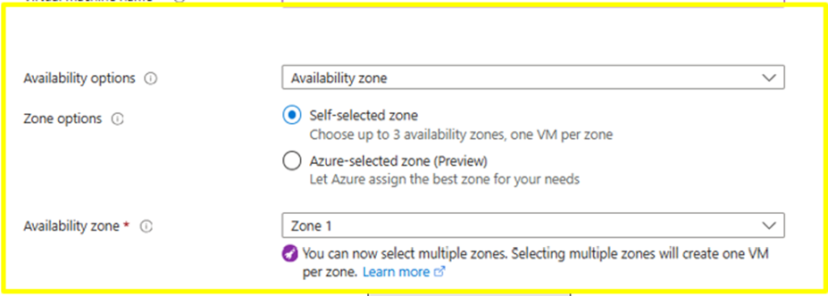
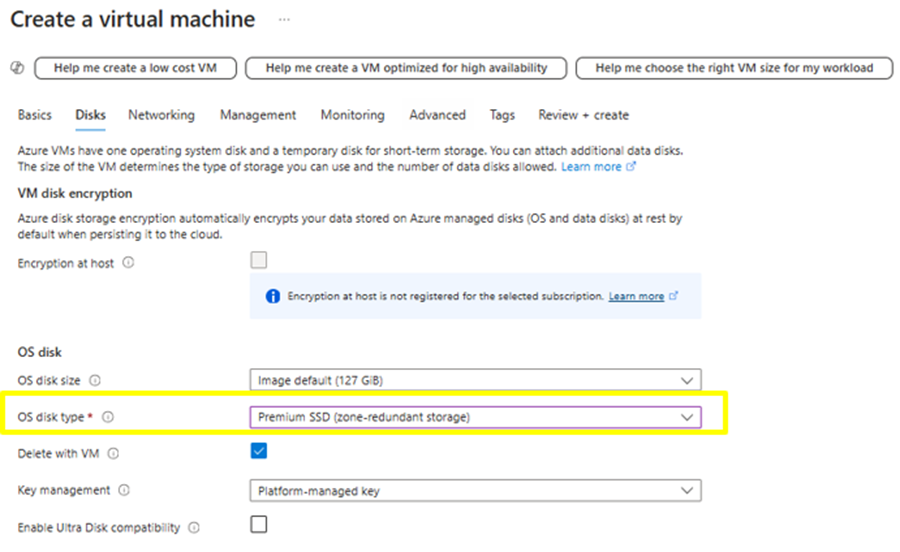
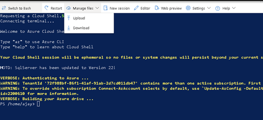

# Private preview of zone movement of VMs across zones

Virtual machines can be recovered quickly from zonal outages by moving them across availability zones. This solution guarantees a Recovery Point Objective (RPO) of zero and a minimal Recovery Time Objective (RTO) in minutes. Note: recovery time depends on capacity reserved when moving VMs across zones. By using [zone redundant disks](https://learn.microsoft.com/en-us/azure/virtual-machines/disks-redundancy#zone-redundant-storage-for-managed-disks) we will are able to provide an RPO of 0. As the feature is dependent on zone redundant disks all its [limitation](https://learn.microsoft.com/en-us/azure/virtual-machines/disks-redundancy#limitations) will apply to the recovery solution as well.

**NOTE: This feature should not be used for production workloads until General Availability (GA). Microsoft Privacy Statement: https://privacy.microsoft.com/en-us/privacystatement**

## Sign up for preview
Sign-up for the preview via this [form](https://aka.ms/ZRVMPrivatePreview).
You will receive an email notification once you are enrolled for the preview. It takes ~4 business days to complete the process. 

## Provide feedback 
Please fill up this [feedback form](https://aka.ms/ZRVMPreviewFeedbackForm) as you try out the feature. This will help us determine the pain points that can be overcome as we launch the next releases.

## Get started
In this private preview customers will be able to move the existing/new virtual machine that meet the prerequisites across availability zone. 

## Supported
- **Regions supported:** All azure production regions.
- VM must be deployed to a specific availability zone. 
- Ensure that the VM has the tag “useNRPDeallocateOnFabricFailure: true”. The tag is crucial as you will not be able to move the VM across zones without this tag on the virtual machine.
- Zone redundant disks data disks (premium/standard) must be used.
- Zone redundant OS disks (premium/standard) or Ephemeral OS disk must be used.
- Static/Dynamic Private IP can be used.
- Public IP SKU should be standard and zone redundant.
- Load Balancer and Gateway should be of standard SKU and zone redundant.
- Supported only via Rest API.

### Create a VM
Please follow the below steps in order. For this example, a new VM is created. The feature will work for an existing VM. If using existing VM please follow from step 4 onwards. Ensure that the prerequisites are met for the existing VM. 

1.	Create a VM in the subscription you have signed up.
2.	Ensure the VM has an availability options set as Availability zone and zone options as self-selected zone. Choose an availability zone (1/2/3) as per your choice.
   
     
   
3.	In disks tab, select the OS and data disks as zone redundant storage as below -

  	
  	
4. If you are using OS disk type as locally redundant storage (LRS) disks you can migrate them to zone redundant storage (ZRS) disks. Please refer to the documentation [here](https://learn.microsoft.com/en-us/azure/virtual-machines/disks-migrate-lrs-zrs?tabs=azure-portal) for the migration. 
5.	In networking tab, please provide the details as you normally would. Please ensure they meet the supported configuration stated above.  
6.	Create a tag `useNRPDeallocateOnFabricFailure: true`.  	
7.	Review and create the VM successfully along with the tag. For existing VM ensure that the tag is added.

## Moving the VM across zone using PS script
1.	Open the Cloud shell (PowerShell) from portal. Direct link -> https://shell.azure.com/ 
2.	Uploading the script that orchestrates moving the VM across zones.
   
      a.	Upload the script [Change-VMZone.ps1](./Change-VMZone.ps1) to cloud shell by navigating to Manage files -> Upload.

  	
  	
      b.	Optionally you can copy the scripts content on a new file using editors.
   
4.	Note the availability zone and the IP address (Public and Private) of the VM you are testing.

5.	To move the VM across zone issue the below command on the CloudShell interface from portal.
   
   `.\Change-VMZone.ps1 -subscriptionId {subscriptionId} -resourceGroupName {resourceGroupName} -vmName {vmName} -targetZone {1 or 2 or 3}`

   | Parameter | Description |
   | --- | --- |
   |SubscriptionId | Virtual machine subscription ID.|
   |ResourceGroupName|Virtual machine resource group.|
   |vmName|Virtual machine name.|
   |targetZone|New availability zone for virtual machine.|

Please fill up this [feedback form](https://aka.ms/ZRVMPreviewFeedbackForm). 

## Moving the VM across zone using REST API
1. The VM has to be force deallocated from the current zone. Below is the command for it:
   ```http
   POST https://management.azure.com/subscriptions/{subscriptionId}/resourceGroups/{resourceGroup}/providers/Microsoft.Compute/virtualMachines/{vmName}?api-version=2024-07-01&forceDeallocate=true
   ```
   You can check the state of the VM in the portal. The state will change from running/unknown/failed to deallocating and then to Stopped (deallocated).
2. Once the VM is stopped. The VM needs to be put in target zone. Below is the command for it:
   ```http
   PUT https://management.azure.com/subscriptions/{subscriptionId}/resourceGroups/{resourceGroup}/providers/Microsoft.Compute/virtualMachines/{vmName}?api-version=2024-07-01
   ```
   ## Request Body
   The following example body is used to create a vault in "West US". Specify the location.
   ```json
   {
     "name": "vmName",
     "location": "WestUS",
     "zones": [
       "2"
     ]
   }
   ```
   You can check the VM's availability zone to be updated to the zone provided in the request body.
  
3. Start the VM in target zone. Below is the command for it:
   ```http
   POST https://management.azure.com/subscriptions/{subscriptionId}/resourceGroups/{resourceGroup}/providers/Microsoft.Compute/virtualMachines/{vmName}/start?api-version=2024-07-01
   ```
   You can check the VM's state change to starting and the running in the target zone.

Please fill up this [feedback form](https://aka.ms/ZRVMPreviewFeedbackForm). 
