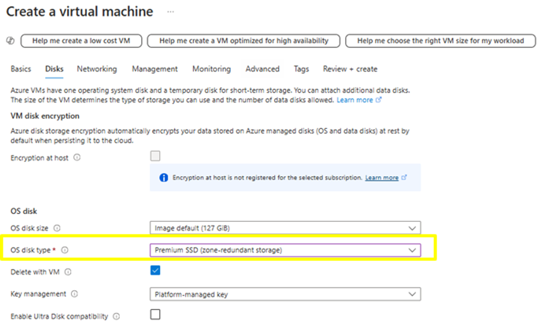
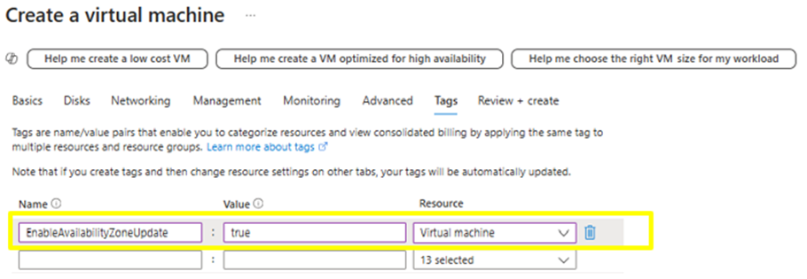
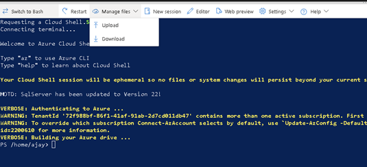

# Enable cross zone recovery for VMs (preview)

Virtual machines can be recovered quickly from zonal outages by moving them across availability zones. This solution guarantees a Recovery Point Objective (RPO) of zero and a minimal Recovery Time Objective (RTO) in minutes. By using [zone redundant disks](https://learn.microsoft.com/en-us/azure/virtual-machines/disks-redundancy#zone-redundant-storage-for-managed-disks) we will are able to provide an RPO of 0. As the feature is dependent on zone redundant disks all its [limitation](https://learn.microsoft.com/en-us/azure/virtual-machines/disks-redundancy#limitations) will apply to the recovery solution as well.

## Sign up for preview

Sign-up for the preview via this [form](https://aka.ms/ZRVMPreview).
You will receive an email notification once you are enrolled for the preview.

## Provide feedback 
Please fill up this [feedback form](https://aka.ms/ZRVMPreviewFeedbackForm) as you try out the preview. This will help us determine the pain points that can be overcome as we launch the next releases.

## Unsupported VM configurations
- VM that are not pinned to an availability zone.
- VMs using [locally redundant disks](https://learn.microsoft.com/en-us/azure/virtual-machines/disks-redundancy#locally-redundant-storage-for-managed-disks) as OS/Data disks.
- Public IP that are regional/have availability zone as “No Zone”
- Public IP with SKU as Basic.

## Get started
In this preview customers will be able to move the existing/new virtual machine that meet the prerequisites across availability zone. 

## Prerequisites
- **Regions supported:** East Asia and UK South. Remaining regions will be available by Mar 2025.
- VM must be deployed to a specific availability zone. 
- Ensure that the VM has the tag “EnableAvailabilityZoneUpdate: true”. The tag is crucial as you will not be able to move the VM across zones without this tag on the virtual machine.
- Zone redundant disks data disks (premium/standard) must be used.
- Zone redundant OS disks (premium/standard) or Ephemeral OS disk must be used.
- Static/Dynamic Private IP can be used.
- Public IP SKU should be standard.
- Load Balancer and Gateway should be of standard SKU.

### Create a VM
Please follow the below steps in order. For this example, a new VM is created. The feature will work for an existing VM. If using existing VM please follow from step 4 onwards. Ensure that the prerequisites are met for the existing VM. 

1.	Create a VM in the subscription you have signed up for this preview.
2.	Ensure the VM has an availability options set as Availability zone and zone options as self-selected zone. Choose an availability zone (1/2/3) as per your choice.
   
     
   
3.	In disks tab, select the OS and data disks as zone redundant storage as below -

  	
  	
4. If you are using OS disk type as locally redundant storage (LRS) disks you can migrate them to zone redundant storage (ZRS) disks. Please see the documentation [here](https://learn.microsoft.com/en-us/azure/virtual-machines/disks-migrate-lrs-zrs?tabs=azure-portal). 
5.	In networking tab, please provide the details as you normally would. You can choose to have a public IP if needed for testing this feature.   
6.	Create a tag `EnableAvailabilityZoneUpdate: true` as below on virtual machine resource – 

  	
  	
7.	Review and create the VM successfully along with the tag. For existing VM ensure that the tag is added.

## Changing zone of VM
1.	Open the Cloud shell (PowerShell) from portal. Direct link -> https://shell.azure.com/ 
2.	Uploading the script that orchestrates moving the VM across zones.
   
      a.	Upload the script [Change-VMZone.ps1](./Change-VMZone.ps1) to cloud shell by navigating to Manage files -> Upload.

  	
  	
      b.	Optionally you can copy the scripts content on a new file using editors.
   
4.	Note the availability zone and the IP address (Public and Private) of the VM you are testing.

5.	To move the VM across zone issue the below command on the CloudShell interface from portal.
   
   `.\Change-VMZone.ps1 -subscriptionId {subscriptionId} -resourceGroupName {resourceGroupName} -vmName {vmName} -targetZone {1 or 2 or 3}`

| Parameter | Description |
| --- | --- |
|SubscriptionId | Virtual machine subscription ID.|
|ResourceGroupName|Virtual machine resource group.|
|vmName|Virtual machine name.|
|targetZone|New availability zone for virtual machine.|

6.	Expected behaviour – 
Refresh the overview blade in the portal for the virtual machine, you would see the VM state change from running to deallocating to deallocated. Within few minutes the VM state will be set to running and the availability zone would be the targetZone provided in the command.

7.	Please fill up this [feedback form](https://aka.ms/ZRVMPreviewFeedbackForm). 

  	
